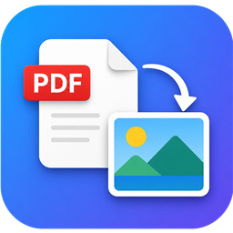

<div align="center">



# PDF Converter

**PDFのページを高品質な画像へ変換する、シンプルなWindowsアプリ**

[](#)
[](#)
[](#)
[-2C68C4?logo=windowsxp&logoColor=white)](#)
[-FF5722)](#)
[](LICENSE)

</div>

---

## ✨ 概要

**PDF Converter**は、PDFの各ページを**PNG / JPEG / BMP**の画像として書き出せるWPFデスクトップアプリです。
レンダリングには[PDFium](https://pdfium.googlesource.com/pdfium/)（[Docnet.Core](https://github.com/GowenGit/docnet)）を採用し、変換前にプレビューを確認しながら、解像度や出力範囲を細かく指定できます。

---

## 🚀 主な機能

| | 機能 | 説明 |
|:---:|:---|:---|
| 🖼️ | **ページプレビュー** | 変換前に各ページを表示。前後移動・ページ番号ジャンプに対応 |
| 🗂️ | **柔軟な出力範囲** | 単一ページ・ページ範囲（例: `1-3,5`）・全ページの保存 |
| 📐 | **解像度の指定** | 幅 (px) / 高さ (px) / DPI で出力サイズをコントロール |
| 🎨 | **複数の画像形式** | `PNG` / `JPEG` / `BMP` を選択可能 |
| 🫧 | **透過の保持** | PNG 出力時に背景の透明度を保持 |
| ⚡ | **並列処理** | CPU コア数に応じてページを並列レンダリングし高速保存 |
| 📋 | **クリップボードコピー** | プレビュー画像をワンクリックでコピー |
| 🖱️ | **ドラッグ＆ドロップ** | PDF をウィンドウへドロップするだけで読み込み |
| 🌗 | **テーマ切替** | ライト / ダーク / システム設定に追従 |
| 🧠 | **メモリキャッシュ** | 一定サイズ以下の PDF をキャッシュし、I/O を削減 |
| 🛑 | **キャンセル対応** | 処理途中での中断が可能 |

---

## 🛠️ 技術スタック

<div align="left">


</div>

- **アーキテクチャ**: MVVM（View / ViewModel / Coordinator / Service の責務分離）
- **DI コンテナ**: `Microsoft.Extensions.DependencyInjection`
- **PDF レンダリング**: `Docnet.Core` (PDFium)
- **ダイアログ**: `Ookii.Dialogs.Wpf`
- **テスト**: 単体テストプロジェクト `PdfConverter.Tests` を同梱

---

## 📦 必要要件

- Windows 10 / 11
- [.NET Framework 4.8.1](https://dotnet.microsoft.com/download/dotnet-framework/net481)
- ビルドする場合: Visual Studio 2022 など（NuGet パッケージの復元が必要）

---

## 🏗️ ビルド & 実行

```powershell
# リポジトリの取得
git clone <repo_url>
cd pdf-converter

# NuGet パッケージの復元
nuget restore src/PdfConverter.slnx

# ビルド（Release 構成）
msbuild src/PdfConverter.slnx /p:Configuration=Release
```

ビルド後、`src/PdfConverter/bin/Release/` に `PDF Converter.exe` が生成されます。

---

## 📖 使い方

1. **PDF を開く** — `参照` ボタンから選択するか、ウィンドウへ **ドラッグ＆ドロップ**
2. **プレビュー確認** — ページを移動しながら出力内容をチェック
3. **出力設定** — 画像形式・解像度・透過の有無を指定
4. **範囲を選ぶ** — 単一ページ / 範囲指定 / 全ページから選択
5. **保存** — 出力先フォルダを指定して変換実行（`page_1.png` のように連番出力）

---

## 🧪 テスト

単体テストは [xUnit](https://xunit.net/) で実装されています。

WPF 本体のビルドには MSBuild が必要なため、次の 2 段階で実行します。

```powershell
# 1. ビルド（Visual Studio 付属の MSBuild を使用）
msbuild src/PdfConverter.Tests/PdfConverter.Tests.csproj /p:Configuration=Release /restore

# 2. テスト実行
dotnet test src/PdfConverter.Tests/PdfConverter.Tests.csproj -c Release --no-build
```

---

## 📂 プロジェクト構成

```text
pdf-converter/
├─ src/
│  ├─ PdfConverter/              # アプリ本体 (WPF / MVVM)
│  │  ├─ Views/                  # 画面 (XAML)
│  │  ├─ ViewModels/             # ViewModel と Coordinator
│  │  ├─ Services/               # PDF 変換・ダイアログ・クリップボード
│  │  ├─ Models/                 # ドメインモデル / 列挙型
│  │  ├─ Themes/                 # ライト / ダークテーマ
│  │  └─ Assets/                 # アイコンなどのリソース
│  └─ PdfConverter.Tests/        # 単体テスト
├─ LICENSE
└─ README.md
```

---

## 📜 ライセンス

本プロジェクトは [MIT License](LICENSE) の下で公開されています。
